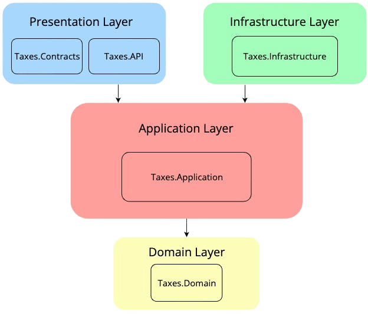

# Complete Tax solution using .NET 8

## About The Project

This project provides complete solution which is built on Clean Architecture.

Clean Architecture was introduced by by Robert C. Martin (Uncle Bob) to provide a better way to build applications in perspective of better testability, maintainability, and dependability on the infrastructures like databases and services

Domain in center and building layer top of it. You can call it as Domain-centric Architecture too.

Though layer architectures like onion, Hexagonal all vary somewhat in their details, they are very similar. All DDD approach have the same objective, which is the separation of concerns. 

### Reference

* [Clean Architecture by Robert C. Martin (Uncle Bob)](https://blog.cleancoder.com/uncle-bob/2012/08/13/the-clean-architecture.html)

## Folder Structure

## Technology stack

Architecture Pattern

- [x] Clean architecture

Design Pattern
- [x] CQRS design pattern
- [x] Mediator design pattern
- [x] Repository design pattern
 
Backend
- [x] Language: C#
- [x] Framework: .net8

Database
- [x] MySql
- [x] DB Connectivity : Microsoft.EntityFrameworkCore, Pomelo.EntityFrameworkCore.MySql - Code First, 

Unit Testing
- [x] Nunit
- [x] Moq
- [x] Shouldly

